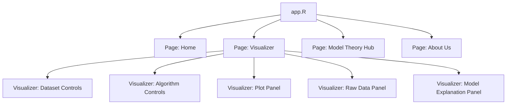

# Architecture

The app has four top-level pages:

- Home
- Visualizer
- Model Theory Hub
- About Us

The Visualizer page owns these internal submodules:

- Dataset Controls
- Algorithm Controls
- Plot Panel
- Raw Data Panel
- Model Explanation Panel

The Visualizer module coordinates:

- `base_classification_data`
- `drawn_classification_data`
- `current_classification_data`
- `trained_model_bundle`

