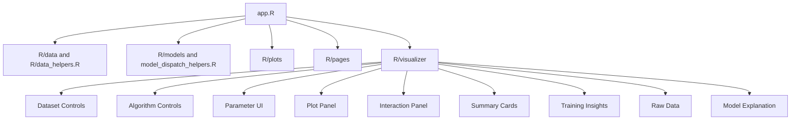

# Architecture

The app is an educational Shiny classifier visualizer with four top-level pages:

- Home
- Visualizer
- Model Theory Hub
- About Us

`app.R` loads shared helpers first, then page and visualizer modules. Keep that source order grouped by dependency: data, metrics, model backends, model dispatch, playback, plots, then Shiny modules.

## Data Helpers

Core dataset frame helpers and the prediction grid live in `R/data_helpers.R`.

Source-specific data logic lives in `R/data/`:

- `preset_datasets.R`: preset dataset routing and seed selection
- `synthetic_datasets.R`: generated toy datasets
- `real_datasets.R`: bundled static CSV presets from `static/`
- `uploaded_datasets.R`: uploaded CSV validation and standardization
- `train_test_split.R`: reproducible 70/30 train/test split

## Model Helpers

Model-specific backends live in `R/models/`:

- `logistic_regression.R`: sigmoid, gradient descent training, saved iteration path, grid/evaluation predictions
- `knn.R`: neighbor lookup, distance/voting helpers, predictions, grid predictions, point inspection

`R/model_dispatch_helpers.R` owns `train_classification_model()`, which validates data, builds the split/grid, and dispatches to the selected model backend.

Future SVM work should add a focused backend under `R/models/` and a small dispatch branch in `R/model_dispatch_helpers.R`.

## Plot Helpers

Plot construction lives in `R/plots/`:

- `main_probability_plot.R`: main probability/decision region plot, train/test point styling, k-NN inspection overlay
- `logistic_diagnostics.R`: loss curve, convergence marker, 3D parameter trajectory, and 2D loss landscape

Plot helpers receive already-computed model outputs. They should not train models or compute metrics.

## Visualizer Modules

The main visualizer coordinator is `R/visualizer/mod_visualizer.R`.

Focused visualizer UI/module files include:

- `mod_visualizer_dataset_controls.R`: preset/upload/drawing controls
- `mod_visualizer_algorithm_controls.R`: algorithm card selection and run trigger
- `mod_visualizer_parameters.R`: algorithm-specific parameter controls
- `mod_visualizer_plot_panel.R`: plot-panel server orchestration and render outputs
- `mod_visualizer_interaction_panel.R`: Logistic playback controls and k-NN inspection panel UI
- `mod_visualizer_summary_cards.R`: Current run and train/test metric card UI
- `mod_visualizer_training_insights.R`: Training insights tab UI
- `mod_visualizer_raw_data.R`: raw data table
- `mod_visualizer_model_explanation.R`: Model Theory / Explanation tab

Future k-NN parameter UI belongs in `mod_visualizer_parameters.R`; future k-NN backend behavior belongs in `R/models/knn.R`.

